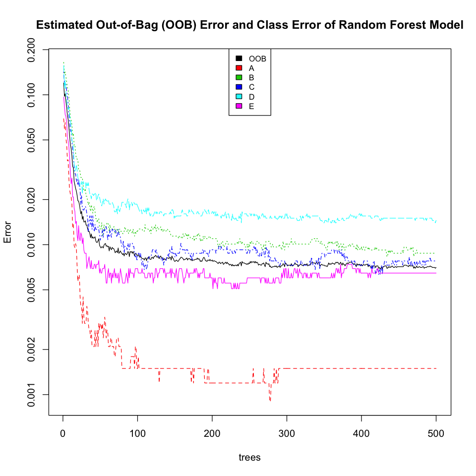
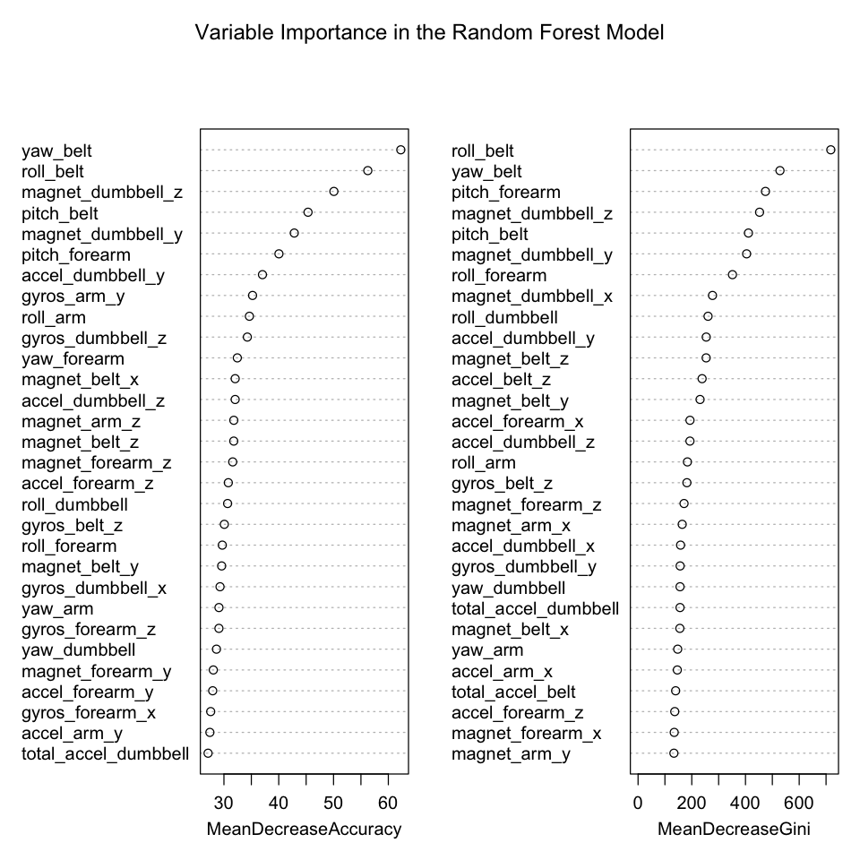

# Practical Machine Learning Project - Human Activity Recognition
by E. Brian Welch using `r sprintf("%s and knitr version %s", R.version.string, packageVersion("knitr"))`  
`r format(Sys.time(), "%B %d, %Y")`  


```
## Loading required package: knitr
```


## Project Overview
The goal of this project is to predict the manner in which a human subject performed a dumbbell (1.25kg) exercise based on accelerometer measurements gathered on a subject's arm, forearm, belt and the dumbbell itself. The Class of excercise included A, B, C, D and E where Class A corresponds to the correct execution of the exercise. The other 4 classes correspond to common mistakes. Exercises were performed by six male participants (age 20-28 years) with limited weight lifting experience. Participants were supervised by an experienced weight lifter to ensure the execution matched the intended simulation manner. Additional study details are available at [http://groupware.les.inf.puc-rio.br/har](http://groupware.les.inf.puc-rio.br/har).

## Data Overview
Data for the project was provided as two comma-separated-variable files `pml-training.csv` (19,622 observations of 160 variables) and `pml-testing.csv` (20 observations of 160 variables). The last column of `pml-training.csv` is the Class (A, B, C, D or E) of the executed dumbbell exercise. The last column of the `pml-testing.csv` is the "problem_id" of the unknown exercise to be predicted by the model created in this project.

## Data Processing and Prediction Results
After loading the orginal testing and training data files, only columns related to belt, arm or dumbbell measurements were kept as predictors. Additionally, any columns containing NA or "#DIV/0!" values were excluded as predictors. Applying these constraints yielded 52 predictors. For cross-validation, the provided training observations were subdivided into 11,778 (60%) train and 7,846 (40%) test observations. Due to its widely known robustness and success in real world applications, a random forest predication model was created.

### 1. Load and Transform Data

```r
# load data
pml_training_original = read.csv('pml-training.csv')
pml_testing_original = read.csv('pml-testing.csv')

# column names related to belt, arm or dumbbell to be used as predictors
colnames_training = colnames(pml_training_original)
colnames_predictors = colnames_training[ grep(".*belt.*|.*arm.*|.*dumbbell.*",
                                              colnames(pml_training_original)) ]

# eliminate predictor columns with NA values
cols_no_NA = sapply(pml_training_original[,colnames_predictors],
                    function(x) !any(is.na(x)))

# reduce predictors to columns free of NA values
colnames_predictors = colnames_predictors[cols_no_NA]

# eliminate predictor columns with "#DIV/0!"
cols_no_DIV0 = sapply(pml_training_original[,colnames_predictors],
                    function(x) length(grep(".*DIV/0.*",x))==0)
colnames_predictors = colnames_predictors[cols_no_DIV0]

# show number of remaining predictors
length(colnames_predictors)
```

```
[1] 52
```

```r
# dataframes containing only the intended predictors
pml_training = pml_training_original[,colnames_predictors]
pml_training$classe = pml_training_original$classe
pml_testing = pml_testing_original[,c(colnames_predictors)]
```

### 2. Prepare for Cross-Validation 

```r
# prepare for cross-validation by partitioning provided training data into 
# train and test subsets
require(caret)
trainIndex = createDataPartition(pml_training$classe, p = 0.60, list=FALSE)
pml_training_train = pml_training[ trainIndex,]
pml_training_test  = pml_training[-trainIndex,]
```

### 3. Create a Random Forest Model

```r
# create a Random Forest model
require(randomForest)
set.seed(20141025)
modelFit = randomForest(classe ~ ., data=pml_training_train)

# display model fit results
modelFit
```

```

Call:
 randomForest(formula = classe ~ ., data = pml_training_train) 
               Type of random forest: classification
                     Number of trees: 500
No. of variables tried at each split: 7

        OOB estimate of  error rate: 0.66%
Confusion matrix:
     A    B    C    D    E class.error
A 3345    2    0    1    0   0.0008961
B   15 2258    6    0    0   0.0092146
C    0   18 2035    1    0   0.0092502
D    0    0   20 1907    3   0.0119171
E    0    0    2   10 2153   0.0055427
```

### 4. Display Plots Describing the Random Forest Model

```r
# Generic plot using model from randomForest
plot(modelFit, log="y",
     main="Estimated Out-of-Bag (OOB) Error and Class Error of Random Forest Model")
legend("top", colnames(modelFit$err.rate), col=1:6, cex=0.8, fill=1:6)
```

 

```r
# Dotchart of variable importance as measured by randomForest
varImpPlot(modelFit, main="Variable Importance in the Random Forest Model")
```

 

### 5. Estimate Out of Sample Error Using Cross-Validation

```r
# estimate out of sample error
pred_out_of_sample = predict(modelFit, newdata=subset(pml_training_test, select=-classe))

# out of sample confusion matrix
confusion_matrix = table(pred_out_of_sample, pml_training_test$classe)
confusion_matrix
```

```
                  
pred_out_of_sample    A    B    C    D    E
                 A 2230    9    0    0    0
                 B    1 1507   11    0    0
                 C    0    2 1356   16    2
                 D    0    0    1 1270    3
                 E    1    0    0    0 1437
```

```r
# estimated out of sample error rate
out_of_sample_error_rate = 1.00 - sum(diag(confusion_matrix)) / sum(confusion_matrix)
out_of_sample_error_rate
```

```
[1] 0.005863
```

### 6. Predict Using pml-test Data

```r
# predict using pml-test data
pred = predict(modelFit, newdata=pml_testing)
pred
```

```
 1  2  3  4  5  6  7  8  9 10 11 12 13 14 15 16 17 18 19 20 
 B  A  B  A  A  E  D  B  A  A  B  C  B  A  E  E  A  B  B  B 
Levels: A B C D E
```

### 7. Write pml-test Predictions to Text Files

```r
# write prediction answers to files
pml_write_files = function(x){
  n = length(x)
  for(i in 1:n){
    filename = paste0("problem_id_", i, ".txt")
    write.table(x[i], file=filename, quote=FALSE, row.names=FALSE, col.names=FALSE)
  }
}
pml_write_files(pred)
```

## Summary
The created random forest model used 500 trees and achieved classification error of approximately 1% or better for all 5 classes. The most important predictors in the random forest model were `yaw_belt` and `roll_belt`. The estimated OOB (out-of-bag) error was 0.66% which agreed well with the separately cross-validated out of sample error rate estimation of 0.59%. The predictions for the 20 cases in the `pml-testing.csv` file scored 100% correct.
